# AWS設計書

## VPC設計

| 項目名   | 値          | 備考 |
| -------- | ----------- | ---- |
| vpc名    | test-vpc    |      |
| cidr範囲 | 10.0.0.0/16 |      |

## subnet設計
### publicsubnet
| 項目名   | 値               | 備考 |
| -------- | ---------------- | ---- |
| subnet名 | test-pub-subnet1 |      |
| cidr範囲 | 10.0.1.0/24      |      |

### privatesubnet
| 項目名   | 値               | 備考 |
| -------- | ---------------- | ---- |
| subnet名 | test-prv-subnet1 |      |
| cidr範囲 | 10.0.2.0/24      |      |